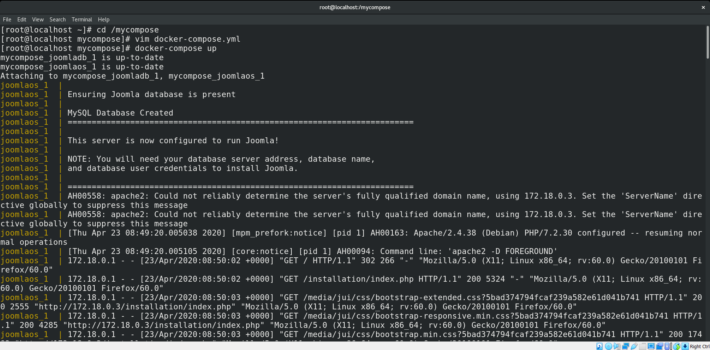
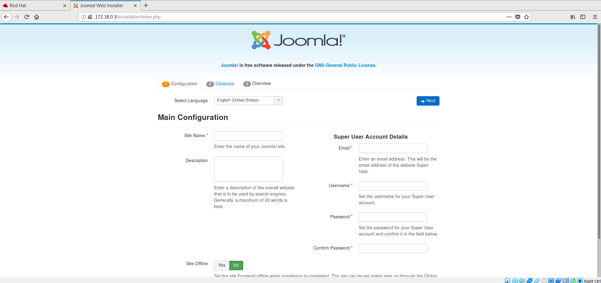

# Docker-Project using Joomla
*This is the final project using Docker to set-up a WebApp called **Joomla**.*
**I will explain you the whole process that has been done for creating the *WebApp*.**

## 1. Pre-configurations:
* *You should have an* **OS** *installed in your sytem. In that* **OS** *you shloud have to install* **Docker** 
* *Here I am using* **RedHat Enterprise Linux OS** *and I have installed* **Docker Community Edition** *in it.*

## 2. Set-Up & Requirements:
* **Disable Filrewall**: *Disabling firewall is not a good choice but, whenever you try to run any network based service then the firewall may block it and the service won't work properly. So, you have to disable firewall for iplementing network based services to system.*
* *Use the following command to stop firewall*
  `systemctl stop firewalld`
* *Use the following command to start firewall*
  `systemctl start firewalld`
## 3. Run Docker: 
For moving towards the project we have to enable docker service in the system so that we can use it.
  *To start docker use command*
   `systemctl start docker`
  *You can use this command to enabke docker permanent*
   `systemctl enable docker`
  *You can check the status of docker by command*
    `systemctl status docker`
  *To stop docker use command*
    `systemctl stop docker`
## 3. Downloading required images:
#### Pulling MySQL Image:
  * *Use* `docker pull mysql:5.7` *to download the* **mysql version 5.7** *image to use as a database server.*
 
#### Pulling Joomla Image:
  * Use `docker pull joomla:3.9-php7.2-apache` to download the Joomla Image in which php and apache server is already preconfigured.
  
     * To know more about MySQL Image go to this page: https://hub.docker.com/_/mysql
      * To know more about Joomla Image go to this page: https://hub.docker.com/_/joomla
      
## 4. Setting up MySQL:
* *Use the code given below and it will create a user with a database inside Your MySQL Server.*
  `docker run -it -e  MYSQL_ROOT_PASSWORD=(your password) -e MYSQL_USER=(your username) -e MYSQL_PASSWORD=(your password) -e MYSQL_DATABASE=(your database name) --name joomladb mysql:5.7` 

* *You can see your database is created ir not by using the client software known as* **MySQL Client Software**
  `yum install mysql`

## 5. Docker-Compose:
* *Docker compose software can be configured by using command*
  `vim docker-compose.yml`
#### Remember 
* *The file name should always be* **docker-compose.yml**.
  *  For reference you can visit to the website: https://docs.docker.com/compose/install/
### Version:
   * *I have used V3(version 3) for docker-compose cause it's easy to compose than the other versions.*
### Volumes set-up:
   * *If you want to make your data permanent then you have to use* **docker valume**. *We make our dara permanent because if we quit the container then all the data inside container will be destryod. This means, due to any reason if our container terminated our data will not loose.*
### Environment:
   * *There are many images in Docker which needs some pre-defined environment variables to run. That's why we need to pass these variables.*
### Dependencies:
  * *For running Joomla it needs MySQL database server to store the files.*
### Ports:
  * *For running the WebApp we have to expose our container to a specific port. WebApp can only be accessible outside the system if we provide it a specific port.*
   
## 6. Docker-compose up:
  * As per the below mentioned picture use `docker-compose up` to complete the setup.

## 7. Joomla Started:
  * Got to your browser and type `localhost:80` and done you will be able to see your Joomla WebApp. Now one small suggestion that you can use directly `localhost` without typing the port cause in http apache server our browser by default use the port 80. But if you want to use any other port then you have to mention it in your docker-compose file.

## 8. Docker-compose start stop:
   * After using docker compose up now in one click you can stop your whole setup. Just use `docker-compose stop`. Again you want to start the service use `docker compose start`. 

## 9. Docker-compose down:
  * You can easily stop the containers using `docker compose down` command.
## Troubleshooting and Solves:
  #### There might be a possibility that you may face some troubleshoots. As we know in these kinds of automations are depended on many things and suppose any of the dependency might not accurate. Here are some suggestions:
   * After you restart your base OS you will see problem cause previous time you stopped your firewall and after system restart firewall will start again. So before again starting docker-compose you should stop firewall. You can check the status of your firewall using `systemctl status firewalld`. If you want to permanently disable firewall you can use `systemctl disable firewalld`.
   * Next problem might happen after you setup your MySQL you up your docker compose and your joomla might not get the connection with MySQL. It's probably because there are limitations that how much container you can connect with your database server. I don't know anything about database handling but as per my knowledge after setting up the MySQL user and database name run this command `docker rm -f $(docker ps -aq)` . This command will remove all the previous containers. Otherwise you can also use `docker ps -a` to see which container is running on MySQL server and you can remove that particular container using `docker rm (container id)`.
   * Next problem might happen like your joomla is unable to connect to database server. It's probably because your iptables doesn't get updated as soon as you do the previously mentioned action. So final and last solution is that you should at first remove the containers create previously by docker compose and then restart your docker using `systemctl restart docker` and now you just up the docker-compose and it will work fine. 
## Future possibilities:
   ### This whole setup is done in local machine. But exactly same thing we can do in cloud to setup a Joomla WebApp. We can use many cloud services like Google Cloud, Digital Ocean etc. for this.
   

